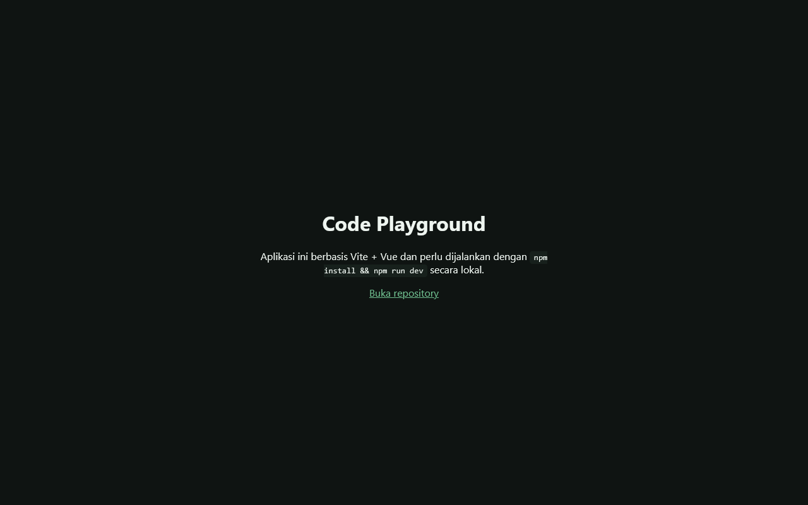

# Code Playground

Vite + Vue playground. Open the static landing on Pages, or run locally with npm for the full editor.



**Live demo:** [https://rogue-dev-studio.github.io/codeplayground/](https://rogue-dev-studio.github.io/codeplayground/)

## Highlights
- Pages: static landing
- Local: `npm install && npm run dev`

## Run
Open `index.html` locally (Live Server on port **5500**), or use the live demo above.

```bash
git clone https://github.com/rogue-dev-studio/codeplayground.git
```

By [Aris Hadisopiyan](https://rogue-dev-studio.github.io/) / Rogue Dev Studio.

MIT
